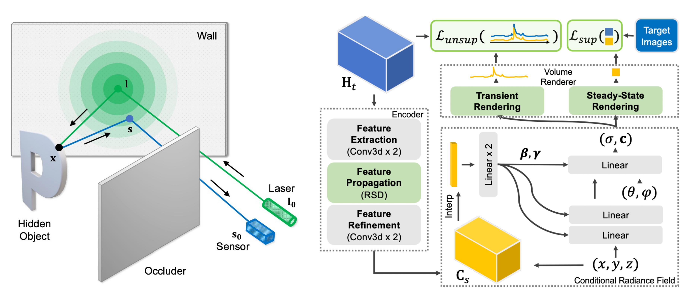

> ## Physics to the Rescue: Deep Non-line-of-sight Reconstruction for High-speed Imaging
> ### [Paper](https://arxiv.org/abs/2205.01679) | [Project Page](https://pages.cs.wisc.edu/~fmu/nlos3d/) | [Video](https://www.youtube.com/watch?v=-re_fZ4BEVg&feature=youtu.be) <br>
> [Fangzhou Mu](https://pages.cs.wisc.edu/~fmu/)<sup>1</sup>, Sicheng Mo<sup>1</sup>, Jiayong Peng<sup>2</sup>, [Xiaochun Liu](https://xiaochunliu.github.io/)<sup>1</sup>, [Ji Hyun Nam](https://jihyun-nam.github.io/)<sup>1</sup>, [Siddeshwar Raghavan](https://siddeshwar-raghavan.github.io/)<sup>1</sup>, [Andreas Velten](https://biostat.wisc.edu/~velten/)<sup>1</sup>, [Yin Li](https://www.biostat.wisc.edu/~yli/)<sup>1</sup> <br>
> <sup>1</sup>University of Wisconsin-Madison, <sup>2</sup>University of Science and Technology of China<br>
> **ICCP 2022 / TPAMI 2022**<br>

<p align="center">
  
</p>

## Overview

This is the official PyTorch implementation of our method for Real-time Non-line-of-sight (NLOS) Reconstruction. Given a transient image captured by a high-speed non-confocal imaging system, our method reconstructs the geometry and appearance of the object hidden around the corner. Our method builds on a deep model that incorporates the complementary physics priors of Rayleigh-Sommerfeld diffraction (RSD) and transient volume rendering, and can tolerate approximations in light transport needed for rapid data acquisition. Our method demonstrates state-of-the-art reconstruction results on both synthetic and real measurements, and can run at an interactive rate on an NVIDIA V100 GPU.

## Quick Start

### Preliminaries

- **Clone the repository**
```shell
git clone https://github.com/fmu2/nlos3d.git
cd nlos3d
```

- **Set up the environment**

Training and evaluation of our method requires GPUs with at least 12GB of memory. We recommend training our models on multiple GPUs.

```shell
conda create -n nlos3d python=3.7
conda activate nlos3d
conda install -c pytorch pytorch==1.7.1 torchvision==0.8.2 cudatoolkit=11.0
conda install -c conda-forge pyyaml tensorboard tensorboardx matplotlib
conda install -c anaconda scipy
pip install opencv-python
```

- **Compile C++ and CUDA extension**
```shell
python setup.py build_ext --inplace
```

### Datasets

Our model is trained on synthetic renderings of alphanumeric characters and [ShapeNet](https://shapenet.org/) objects. We adopt an off-the-shelf transient rasterizer from [here](https://github.com/princeton-computational-imaging/NLOSFeatureEmbeddings) for the synthesis of training pairs. A training pair consists of a transient measurement at `33ps` time resolution and an intensity image of size `128 x 128` for alphanumeric characters or an RGB image of size `256 x 256` for ShapeNet objects. The full alphanumerics dataset is `5.6GB` in size and can be downloaded from [here](https://drive.google.com/file/d/1Myzu9drouHq53xU6eyeqBsjYnW2Tor8L/view?usp=sharing). The 3D models (`111` in total) used for rendering can be downloaded from [here]((https://drive.google.com/file/d/1-D4CeWqGIm4mg9izn5H6-rDtEF8U80RD/view?usp=sharing)).

We evaluate our method on both synthetic and real measurements. In particular, the real measurements are captured using a real-time, non-confocal NLOS imaging system we built in house. The system specifications can be found [here](https://www.nature.com/articles/s41467-021-26721-x). We will release the real measurements used in our experiments in the future. Stay tuned!

### Training and Evaluation

Our code supports multiple models, including

* [Learned Feature Embeddings (LFE)](https://light.cs.princeton.edu/publication/nlos-learnedfeatures/), the learning-based method we compared to as a baseline in our paper;
* A variant of [Neural Transient Fields (NeTF)](https://arxiv.org/abs/2101.00373) that adopts our proposed forward rendering recipe for faster training and stronger reconstruction results;
* Our proposed method with supervised and unsupervised training.

Training any of these models will introduce a folder in `./ckpt` with the config file, training logs and model checkpoints. Sample configuration files for training and evaluation can be found in `./configs`.

In addition, we provide a differentiable, modular implementation of [Phasor Field RSD](https://biostat.wisc.edu/~compoptics/phasornlos20/fastnlos.html) that can run on GPU. RSD is the state-of-the-art analytic reconstruction method for the non-confocal imaging setup.

- **Train and evaluate LFE**

```shell
python train_nr.py -d {data_path} -c {train_config_path} -n {job_name} -g {gpu_id}
python test_nr.py -ckpt {checkpoint_folder} -c {eval_config_path} -g {gpu_id}
```

- **Train and evaluate our NeTF variant**

```shell
python train_unsup_per_scene.py -d {data_path} -c {train_config_path} -n {job_name} -g {gpu_id}
python test_vr_per_scene.py -ckpt {checkpoint_folder} -c {eval_config_path} -g {gpu_id}
```

- **Train and evaluate our method**

Our method can be trained in a supervised or unsupervised manner. For supervised training, run

```shell
python train_sup.py -d {data_path} -c {train_config_path} -n {job_name} -g {gpu_id}
python test_vr.py -ckpt {checkpoint_folder} -c {eval_config_path} -g {gpu_id}
```

For unsupervised training, run

```shell
python train_unsup.py -d {data_path} -c {train_config_path} -n {job_name} -g {gpu_id}
python test_vr.py -ckpt {checkpoint_folder} -c {eval_config_path} -g {gpu_id}
```

- **RSD evaluation**

RSD is an analytic reconstruction method. To reconstruct a scene using RSD, run

```shell
python rsd_per_scene.py -c {config_path} -n {job_name}
```

To evaluate RSD on all samples in a dataset, run

```shell
python rsd.py -c {config_path} -n {job_name} -g {gpu_id}
```

Reconstruction results will be saved in `./rsd`.

### Pretrained models

We provide several [pre-trained models](https://drive.google.com/drive/folders/1-LVWpOHBrw7gqH1O0iAoui4d1Wp4HHXv?usp=sharing). These models are trained on the alphanumerics dataset. They are not the same models we used for evaluation in the paper, yet should yield comparable results. More models will be added later. Stay tuned!

## Contact
[Fangzhou Mu](http://pages.cs.wisc.edu/~fmu/) (fmu2@wisc.edu)

## Reference

Please consider citing our paper if you find our code useful.

```
@ARTICLE {9874257,
author = {F. Mu and S. Mo and J. Peng and X. Liu and J. Nam and S. Raghavan and A. Velten and Y. Li},
journal = {IEEE Transactions on Pattern Analysis &amp; Machine Intelligence},
title = {Physics to the Rescue: Deep Non-Line-of-Sight Reconstruction for High-Speed Imaging},
year = {5555},
volume = {},
number = {01},
issn = {1939-3539},
pages = {1-12},
doi = {10.1109/TPAMI.2022.3203383},
publisher = {IEEE Computer Society},
address = {Los Alamitos, CA, USA},
month = {aug}
}
```

If you use our RSD implementation, please also cite the following paper:

```
@article{liu2020phasor,
  title={Phasor field diffraction based reconstruction for fast non-line-of-sight imaging systems},
  author={Liu, Xiaochun and Bauer, Sebastian and Velten, Andreas},
  journal={Nature communications},
  volume={11},
  number={1},
  pages={1--13},
  year={2020},
  publisher={Nature Publishing Group}
}
```
=======
# Under construction
>>>>>>> 81aff4b91e520625ad462da11806a792581c6295
